# 1.1. 批处理程序是什么

定义：==Batch File Programming 是微软操作系统自带原生的开发语言==，该语言开发出来的程序称为批处理程序（又称脚本），源文件扩展名为 bat 或者 cmd 。

作用：使用 Windows 内置命令和外部命令进行自动化操作，例如删除文件清理内存、整蛊他人电脑等。

- 内部命令：Windows 系统自带的命令：
  - 操作类命令 `echo` 、 `del` 、 `cd` 等；
  - 查询类命令 `ipconfig` 、`arp -a` 等；
  - 工具类命令 `calc` 、 `notepad` 、 `cmd` 等； 
  
- 外部命令：需要安装相应的编译器才能使用的命令，例如 java 、python 等。

特点：①由于 Windows 系统不区分大小写，所以脚本也不区分大小写

②批处理的编程能力远不如 C 语言等编程语言，也十分不规范；

③脚本的每一行都是一条 DOS 命令；

④在命令提示符下键入批处理文件的名称，或者双击该批处理文件，系统就会调用 Cmd.exe 来运行该文件。

# 1.2. 环境的打开

运行环境：不需要构建任何环境，因为 Windows 系统自带开发环境和执行环境，使用==命令提示符== cmd.exe 即可开发和运行。

方法一：在任务栏搜索框输入 `cmd` ，回车。

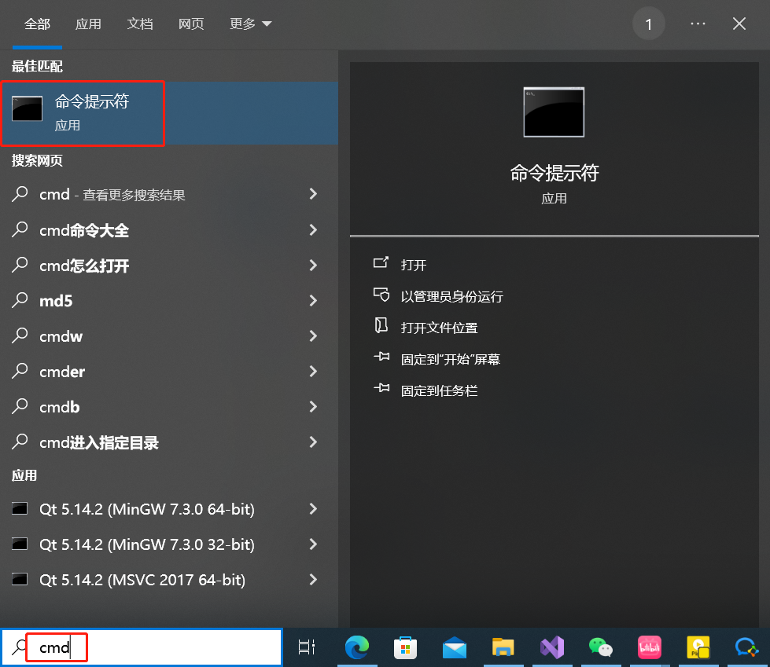

方法二：快捷键 Win + R ，输入 cmd ，回车。

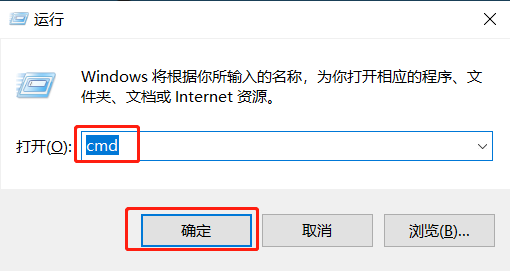

方法三：找到磁盘路径并双击打开 C:\Windows\System32\cmd.exe 。

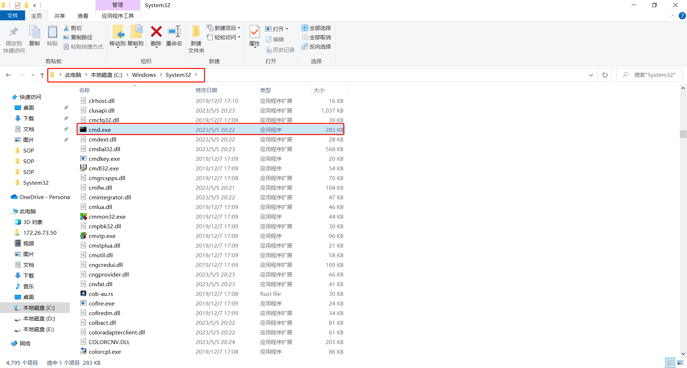

方法四：在当前目录下的路径栏输入 `%comspec%` ，回车。

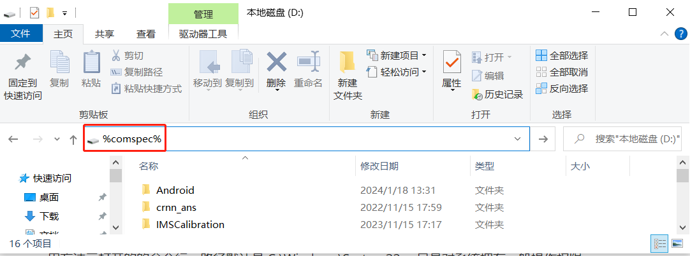

方法五：在当前目录下的路径栏输入 `cmd` ，回车。

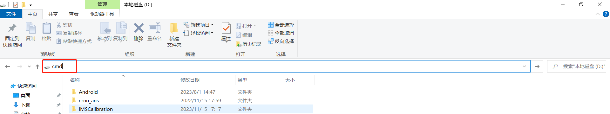

注意：用方法一或者方法二打开的命令行，路径默认是 C:\Users\当前系统登陆的用户名。

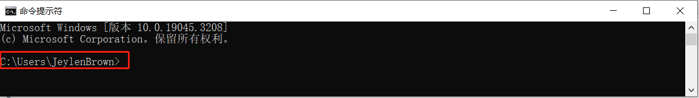

用方法三打开的的命令行，路径默认是 C:\Windows\System32 ，只是对系统拥有一般操作权限。

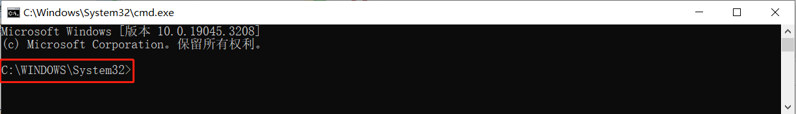

在方法三基础上，鼠标右击→以管理员身份运行。

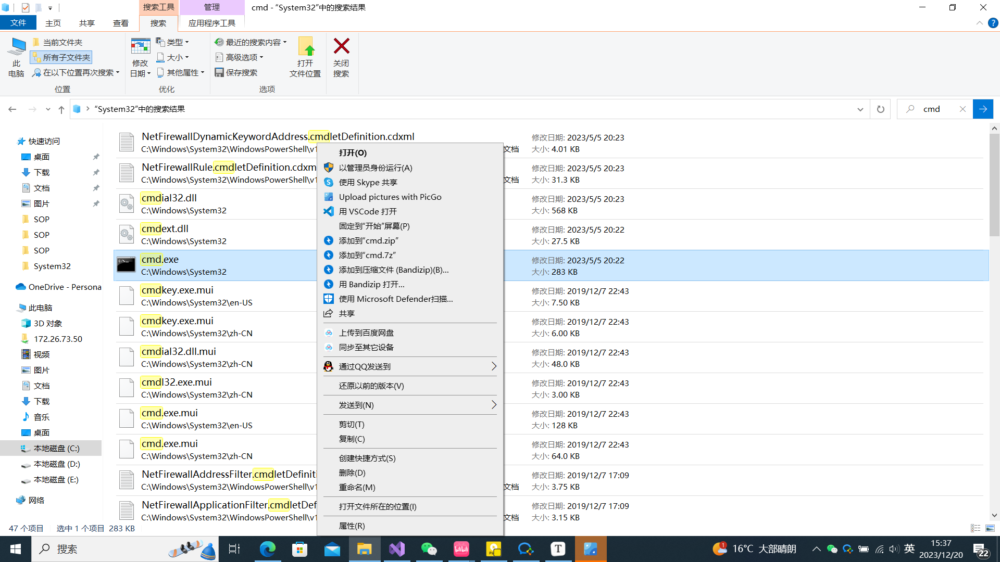

路径默认是 C:\Windows\System32 ，不仅命令提示符窗口标题多出《管理员》文字，并且对系统拥有最高操作权限。

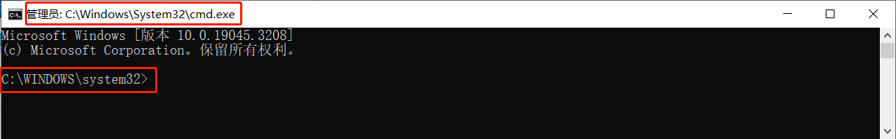

用方法四或者方法五打开的的命令行，路径默认是 当前路径（例如 D 盘下打开） 。

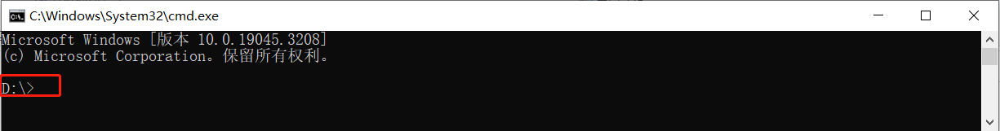

# 1.3. 代码编辑环境

任何文本编辑器，包括记事本文件、Notepad++ 、VSCode 等。编辑完成后，因为 Windows 中文操作系统将记事本编码默认为 UTF-8 ，需要将文件另保存为 ANSI 格式，否则运行脚本中文会乱码，并将文件扩展名更改为 bat 或者 cmd 。

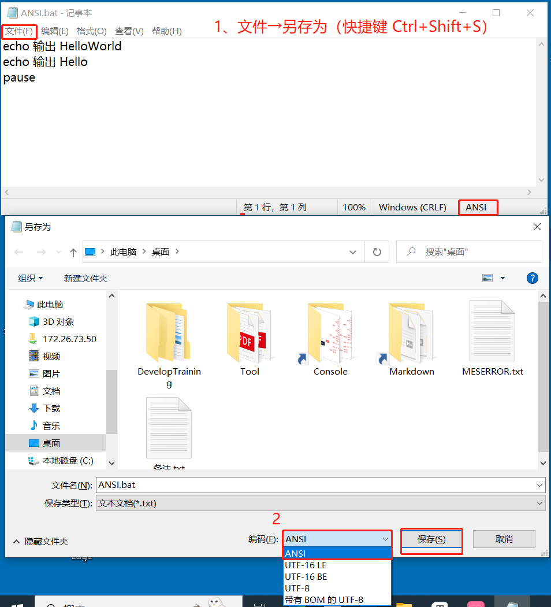

编码为 UTF-8 时，运行脚本中文会乱码如下图：

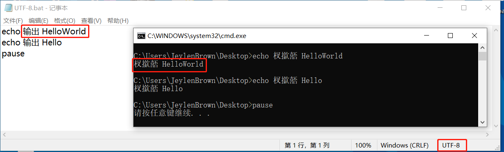

# 1.4. 属性设置

鼠标右击 cmd 窗口白色处，选择属性。

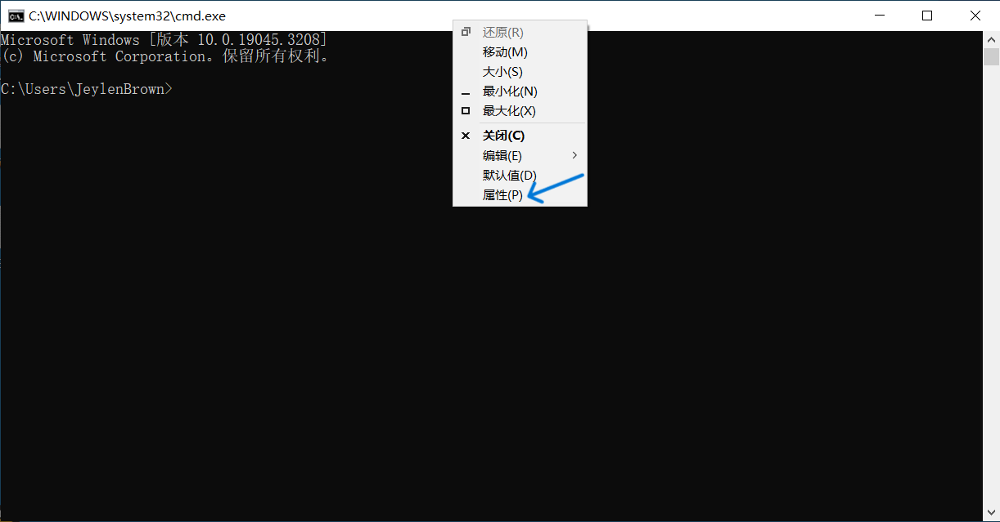

最重要的-选项设置如图：

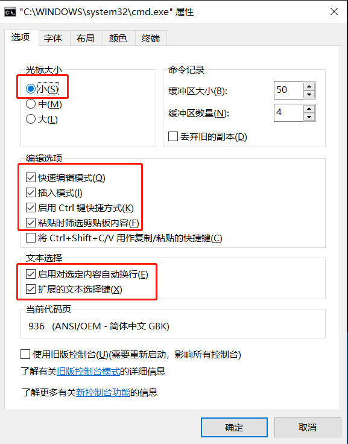

其余设置看个人喜好即可。

# 1.5. HelloWorld

```bash
::@ 功能			：不显示 @ 后面的单行命令
::echo off 功能	：关闭该行以下其他命令在命令行窗口的回显（不包括本身这条命令），即不显示路径和要执行的命令行，常用于在入侵其他主机不让对方看到命令提示
@echo off
::echo 作用		：把 echo 后面的单行内容显示到控制台上
echo 输出 HelloWorld
echo 输出 Hello
::pause 作用		：暂停执行程序，并在命令行窗口显示 Press any key to continue... 的提示，等待用户按任意键后继续。如果不写 pause 命令，会直接关闭批处理文件，一闪而过看不见任何效果 
pause
```

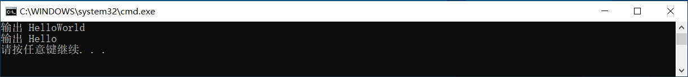

如果不添加 @echo off 命令， cmd 终端会重复输入每行命令、执行每行命令、输出每行结果。

```bash
echo 输出 HelloWorld
echo 输出 Hello
pause
```

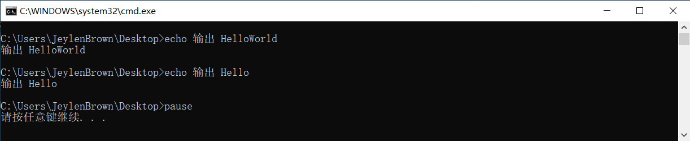

