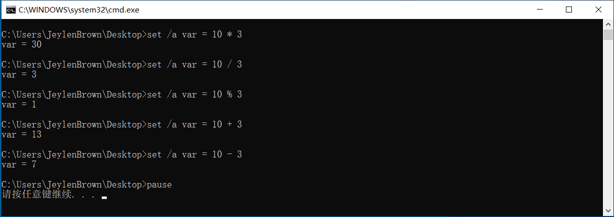
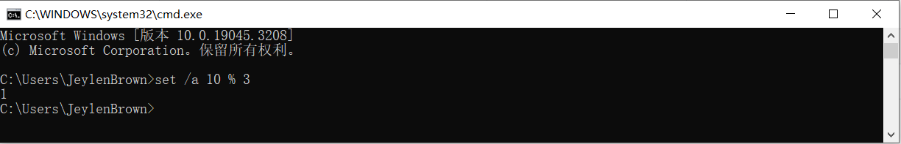
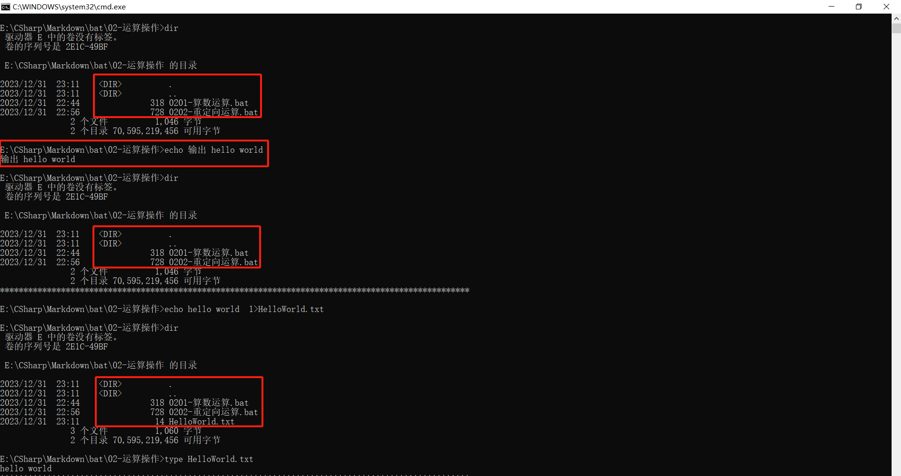
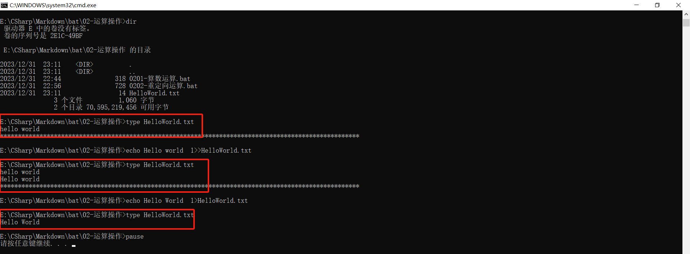
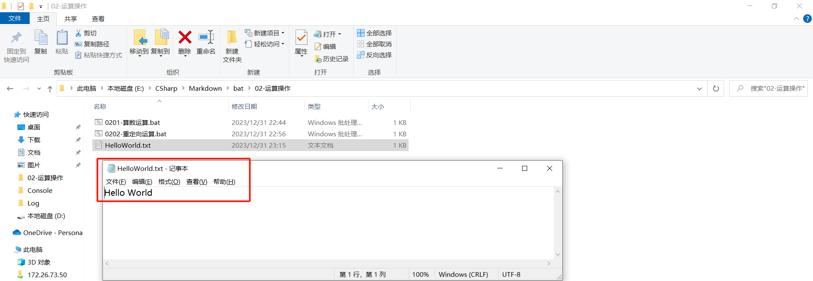
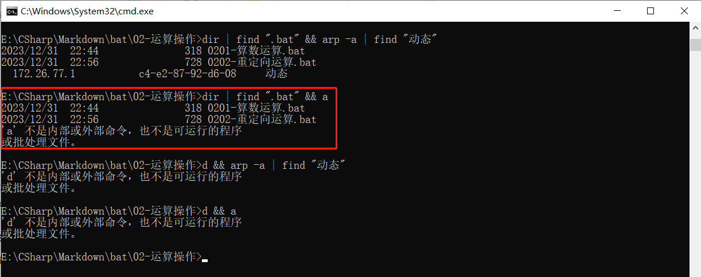
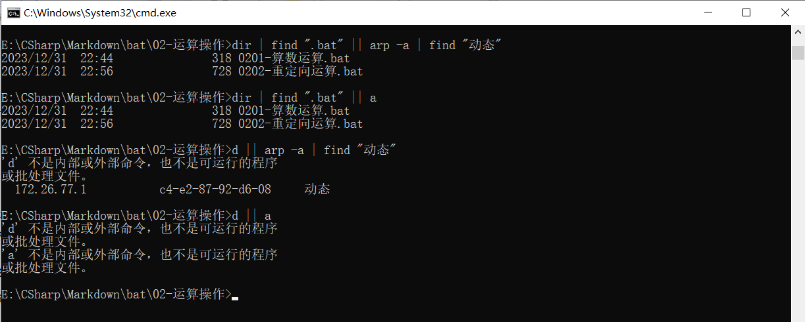
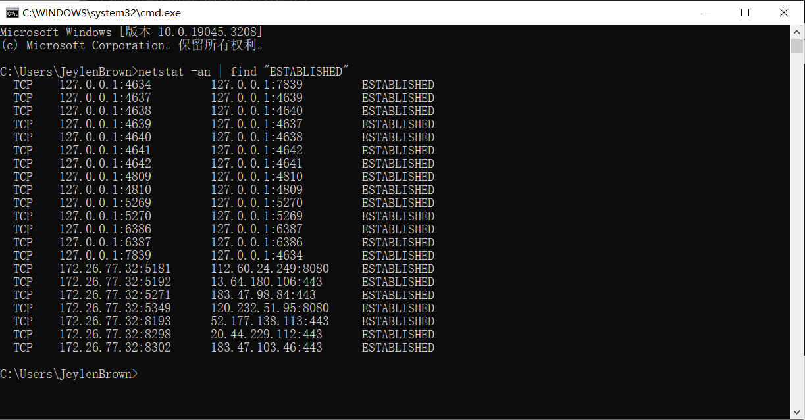

# 2.1. 变量

| 规则 |      官方强制要求的编写语法      |                   不遵守会对影响代码执行                   |
| ---- | :------------------------------: | :--------------------------------------------------------: |
| 规范 | 官方和大厂建议的编写要求，不强制 | 不遵守也不会对影响代码执行，尽量遵守，让代码更高级、更易懂 |

定义：在程序运行时，能储存计算结果或能表示值的抽象概念。

特点：程序运行时，可能会改变变量的值。

标识符命名规则：

- 标识符不能是关键字；
- 标识符只能由字母、数字、下划线组成；
- 必须为字母、下划线开头；
- 标识符中字母不区分大小写；
- 尽量见名知义，对于多个单词组合的使用**驼峰式命名** 

# 2.2. 注释

定义：在程序代码中对程序代码进行解释说明的文字。

作用：

- 对程序代码进行解释说明，能够大大增强程序的可读性。
- 注释不是程序，不能被执行。

|     格式     | 使用情况 | 是否允许换行 | 是否允许嵌套 |
| :----------: | :------: | :----------: | :----------: |
| rem 注释内容 | 单行注释 |      否      |      是      |
| :: 注释内容  | 单行注释 |      否      |      否      |

# 2.3. 运算操作

## 2.3.1. 算数运算

| 运算符 |     术语     |  实例  | 结果 |
| :----: | :----------: | :----: | :--: |
|   +    |     正号     |   3    |  3   |
|   -    |     负号     |   -3   |  -3  |
|   *    |      乘      | 10 * 3 |  30  |
|   /    |      除      | 10 / 3 |  3   |
|   %    | 取模（取余） | 10 % 3 |  1   |
|   +    |      加      | 10 + 3 |  13  |
|   -    |      减      | 10 - 3 |  7   |

算术运算的优先级：有括号先算括号里面的，再算乘、除、求模，最后算加、减

```bash
::输入变量不需要用两个 % 包围
set /a var = 10 * 3
::输出变量值需要用两个 % 包围，否则输出的是变量名字符串，而不是变量值
::%CD%		扩展到当前目录字符串。
::%DATE%	用跟 date 命令同样的格式扩展到当前日期。
::%TIME%	用跟 time 命令同样的格式扩展到当前时间。
@echo var = %var%

set /a var = 10 / 3
@echo var = %var%

set /a var = 10 %% 3
@echo var = %var%

set /a var = 10 + 3
@echo var = %var%

set /a var = 10 - 3
@echo var = %var%

pause
```



注意：在命令提示符下，输入命令 `set /a 10%3 ` 后回车即可得到结果。



但在文本模式下，由于 % 在编程属于格式控制字符，要想输出单个 % ，命令应变更为 `set /a var = 10 %% 3` 

## 2.3.2. 关系运算

| 运算符 | 术语 |
| :----: | :--: |
|   >    | 大于 |
|   <    | 小于 |

## 2.3.3. 重定向运算

定义：命令执行的结果会移交给下一个执行的命令。

特点：其运算符的箭头的所指方向表示将数据存储到对应的结果位置（文件流）。

| 运算符 |                             作用                             |
| :----: | :----------------------------------------------------------: |
|   >    |      符号左边的内容保存到符号右边的文件，覆盖原有的数据      |
|   <    |      符号右边的内容保存到符号左边的文件，覆盖原有的数据      |
|   >>   | 符号左边的内容保存到符号右边的文件，末尾下方另起一行追加内容 |
|   <<   | 符号右边的内容保存到符号左边的文件，末尾下方另起一行追加内容 |
|  type  |                     查看==文本文件==内容                     |

```bash
::查看当前目录下的文件架构，其中 . 表示本级目录， .. 表示上级目录
dir
echo 输出 hello world
::只是输出 hello world ，并没有产生文本
dir
@echo ****************************************************************************************************
::将 HelloWorld 写入到 HelloWorld.txt 文件
echo hello world > HelloWorld.txt
dir
::查看文件内容，前提是该文件是文本文件
type HelloWorld.txt
@echo ****************************************************************************************************
echo Hello world >> HelloWorld.txt
type HelloWorld.txt
@echo ****************************************************************************************************
echo Hello World > HelloWorld.txt
type HelloWorld.txt
pause
```







## 2.3.4. 多命令运算

定义：一行命令中存在多条命令，可使用多命令运算符实现。

|            术语            | 运算符 |   实例   | 结果（假设命令 a 在多命令运算符的左边，命令 b 在多命令运算符的右边） |
| :------------------------: | :----: | :------: | :----------------------------------------------------------- |
| 逻辑与，等价于数学中的"且" |   &&   |  a && b  | 当 a 和 b 两条命令都正确时，分别返回各自命令的执行结果<br>当 a 正确 b 不正确时，返回 a 的执行结果，b 不是内部或外部命令，也不是可运行的程序或批处理文件<br/>当 a 不正确，无论 b 是否正确，都仅仅返回 a 不是内部或外部命令，也不是可运行的程序或批处理文件，不再执行命令 b |
| 逻辑或，等价于数学中的"或" |  \|\|  | a \|\| b | 当 a 正确，无论 b 是否正确，都仅仅返回 a 的执行结果，不再执行命令 b<br/>当 a 不正确 b 正确时，返回 a 不是内部或外部命令，也不是可运行的程序或批处理文件，再执行命令 b<br/>当 a 和 b 两条命令都不正确时，分别返回各自命令不是内部或外部命令，也不是可运行的程序或批处理文件 |





## 2.3.5. 管道操作运算

定义：对于形如 A | B 的命令格式，表示命令 A 的输出结果，作为命令 B 的输入来执行

