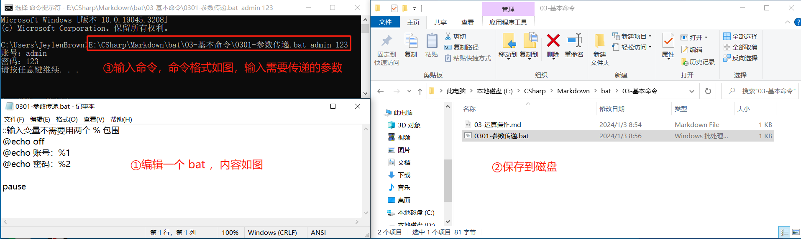
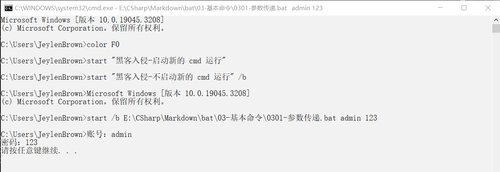
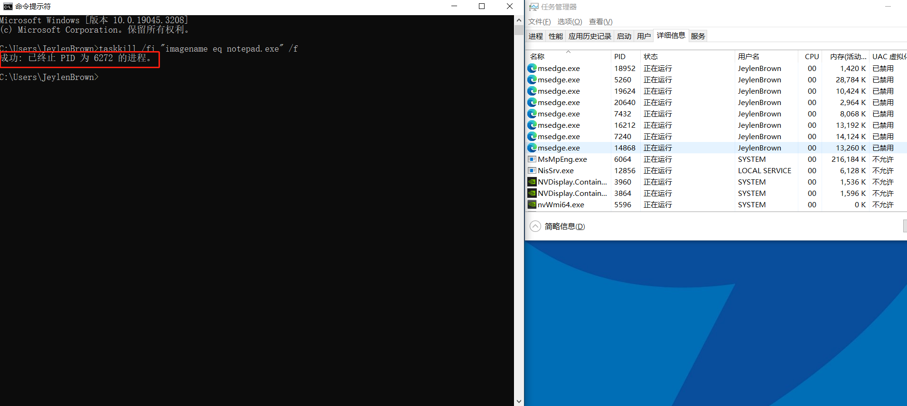
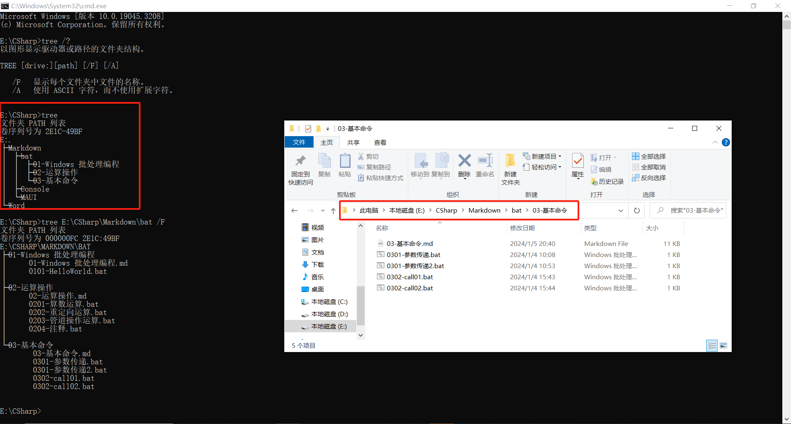

# 3.1. 帮助信息

语法 1 ：`命令 /?`

作用：提示该命令的语法格式


语法 2 ：`命令 /help`

作用：提示该命令的语法格式以及命令使用详情


# 3.2. 参数传递

语法：`%number`


实例：使用 `net user %1 %2 /add` 命令，在 cmd 传递 userName 和 password 参数，然后用 `net user` 看看效果。最后使用 `net user Test /delete` 删除刚刚创建的账户。

```bash
@echo off
echo 使用管理员权限打开 cmd ，因为使用 net user 命令操作用户账户需要最高权限
echo 如果不使用管理员权限打开 cmd ，执行命令后会提示《发生系统错误 5。 拒绝访问。》
echo 在 cmd 输入命令格式：脚本绝对路径 用户名 密码
echo 按下回车键后，将会给主机添加 cmd 输入的 Windows 用户
net user %1 %2 /add
pause
```

直接打开 CMD 窗口运行命令如下：


以管理员是身份打开 CMD 窗口运行命令如下：


# 3.3. 更改颜色、标题

| 命令  | 语法             | 参数                                                         |              作用              |              实例               |
| ----- | ---------------- | :----------------------------------------------------------- | :----------------------------: | :-----------------------------: |
| color | `color [attr]`   | attr：指定控制台输出的颜色属性，如果没有给定任何参数，此命令会将颜色还原到 cmd.exe 启动时的颜色。 | 设置默认的控制台前景和背景颜色 | `color fc` 在亮白色上产生淡红色 |
| title | `title [string]` | string：指定命令提示窗口的标题                               |   设置命令提示窗口的窗口标题   |        `title 黑客入侵`         |

颜色属性由两个十六进制数字指定，第一个对应背景色（窗口颜色），第二个对应前景色（字体颜色）。每个数字可以为以下任何值：

> 注意：①如果同时使用相同的前景色和背景色，没有任何效果
> ②只是一次改变，重启 cmd.exe 会还原到 cmd.exe 启动时的颜色，即 color 07

| 0 = 黑色 | 1 = 蓝色   | 2 = 绿色   | 3 = 浅绿色   | 4 = 红色   | 5 = 紫色   | 6 = 黄色   | 7 = 白色   |
| -------- | ---------- | ---------- | ------------ | ---------- | ---------- | ---------- | ---------- |
| 8 = 灰色 | 9 = 淡蓝色 | A = 淡绿色 | B = 淡浅绿色 | C = 淡红色 | D = 淡紫色 | E = 淡黄色 | F = 亮白色 |

`color fc` 运行效果如下：


`color` 运行效果如下：


`title 黑客入侵` 运行效果如下：


# 3.4. 时间

| 命令 |        语法         |                            作用                             |
| :--: | :-----------------: | :---------------------------------------------------------: |
| date | `DATE [/T \| date]` | /T：只显示日期，不设置日期<br/>没有参数：显示日期并设置日期 |
| time | `TIME[/T \| time]`  | /T：只显示时间，不设置时间<br/>没有参数：显示时间并设置时间 |


# 3.5. 启动

| 命令  |      语法       |                   作用                   |
| :---: | :-------------: | :--------------------------------------: |
| start | `start /?` 查询 | 启动一个单独的窗口以运行指定的程序或命令 |




# 3.6. 调用

| 命令 |      语法      |                             作用                             |
| :--: | :------------: | :----------------------------------------------------------: |
| call | `call /?` 查询 | 从批处理程序调用另一个批处理程序，可以不用再次在当前文件编写相关代码 |


# 3.7. 任务列表查看

|    命令    |        语法        |                             作用                             |
| :--------: | :----------------: | :----------------------------------------------------------: |
| `tasklist` | `tasklist /?` 查询 | 在本地或远程机器上显示当前运行的进程列表。由于安全性，远程机器需要验证账号和密码 |

> 注意：`tasklist` 命令获取的是正在运行的进程，如果用户关闭或者打开进程是无法监到的，只能重新运行 `tasklist` 命令


`tasklist /m [动态库名.dll]` ：列出当前使用所给 exe/dll 名称的所有任务。如果没有指定模块名称，显示所有加载的模块。


`tasklist /svc` ：显示每个进程中主持的服务


`tasklist /fi "status eq running"` ：筛选所有正在运行进程并显示。


`tasklist /fi "status eq running" /[fo table | list | csv] ` ：筛选需要查询的进程号，[并进行格式化输出以表格/列表/csv 格式显示] ，不加 /fo 参数默认以表格方式输出。也可以使用重定向将结果保存到文本中。


>注意：eq 表示 equal ，ne 表示 not equal ，gt 表示大于等于，lt 表示大于，gt 表示小于等于，gt 表示小于。


# 3.8. 任务终止

|   命令   |        语法        |                 作用                 |
| :------: | :----------------: | :----------------------------------: |
| taskkill | `taskkill /?` 查询 | 按照进程 ID (PID) 或映像名称终止任务 |

其参数入下表：

| 参数 |     含义      | 作用                                                         |
| :--: | :-----------: | ------------------------------------------------------------ |
|  /S  |    system     | 指定要连接的远程系统                                         |
|  /U  | [domain\]user | 指定在哪个用户执行这个命令                                   |
|  /P  |  [password]   | 为提供的用户指定密码。如果忽略，提示输入                     |
| /FI  |    filter     | 应用筛选器以选择一组任务。允许使用 "\*\" ，例如，映像名称 eq acme* |
| /PID |   processed   | 指定要终止的进程的 PID。使用 tasklist 或者任务管理器的详情获取 PID |
| /IM  |   imagename   | 指定要终止的进程的映像名称。通配符 '*'可用来指定所有任务或映像名称 |
|  /T  |     tree      | 终止指定的进程和由它启用的子进程                             |
|  /F  |     force     | 指定强制终止进程。如果终止的是未保存的文件，即使提示发送了终止信号，但实际上是没有关闭记事本的，会弹窗提示是否保存内容，还要进一步操作才能关闭记事本。但是如果添加 /f 参数，会强制关闭进程，不保存后面编辑的内容 |


> 注意：① /PID 和 /IM 不同时使用；
> ②只有在应用筛选器的情况下，/IM 才能使用通配符 '*'。
> ③远程进程总是要 /F  终止。
> ④一般来说普通程序不需要使用最高权限来运行，如果普通程序使用 System 用户来运行，则该程序有问题，建议关闭

## 3.8.1. taskkill /im

可以通过映像名称去关闭记事本，执行命令前如图：


执行命令后如图，记事本被关闭，再次运行相同的命令会提示`错误：没有找到进程`。


## 3.8.2. taskkill /pid

也可以通过进程号去关闭记事本，执行命令前如图：


执行命令后如图，记事本被关闭，再次运行相同的命令会提示`错误:没有找到进程 AAA`。


## 3.8.3. taskkill /fi /f

也可以筛选器去关闭记事本，执行命令前如图：


回车后，记事本被关闭。再次运行相同的命令会提示没有运行的带有指定标准的任务，打开记事本发现未保存的后续编辑的内容被丢失。



# 3.9. 文件结构查看

| 命令 |              语法               |                    作用                    |
| :--: | :-----------------------------: | :----------------------------------------: |
| tree | `tree [drive:][path] [/F] [/A]` | 以图形显示驱动器或==当前路径==的文件夹结构 |

其参数入下表：

| 参数 | 含义  |               作用                |
| :--: | :---: | :-------------------------------: |
|  /F  | file  |    显示每个文件夹中文件的名称     |
|  /A  | ASCII | 使用 ASCII 字符，而不使用扩展字符 |



# 3.10. 关机

以下是关于电脑关机、休眠、睡眠和锁屏的特点的简要总结：

| 中文术语 |                             关机                             |                             休眠                             |                             睡眠                             |                           锁屏                           |
| :------: | :----------------------------------------------------------: | :----------------------------------------------------------: | :----------------------------------------------------------: | :------------------------------------------------------: |
| 英文术语 |                           Shutdown                           |                          Hibernate                           |                            Sleep                             |                           Lock                           |
| 是否断电 |            所有硬件都断电，对于台式机则拔掉电源线            |                        所有硬件都断电                        |           除内存外都断电，对于手提电脑则盖上显示屏           |  内存、CPU、显卡等全部通电，对于台式机则不准拔掉电源线   |
| 耗电情况 |                              无                              |                             极少                             |                             较少                             |                         正常耗电                         |
| 缓存数据 |                             清空                             |                          保存到硬盘                          |                          保存到内存                          |                        仍存在缓存                        |
| 唤醒操作 |                           按电源键                           |                           按电源键                           |                     移动鼠标或者敲击键盘                     |                   最多需要输入密码解锁                   |
| 唤醒时间 |                              长                              |                    硬盘读写较慢，耗时较长                    |                    内存读写较快，耗时较短                    |                            短                            |
| 任务管理 | 关机时：关闭所有运行的程序和进程<br>唤醒时：所有软硬件初始化 | 休眠时：关闭显示器，计算机进入低功耗模式<br/>唤醒时：快速恢复休眠前状态 | 睡眠时：关闭显示器和硬盘，计算机进入低功耗模式<br/>唤醒时：快速恢复睡眠前状态 | 锁定计算机屏幕，计算机仍保持锁屏前状态，不影响进行的任务 |

语法如下：

|   命令   |        语法        |          作用          |
| :------: | :----------------: | :--------------------: |
| shutdown | `shutdown /?` 查询 | 关机、重启、休眠、注销 |

其常用参数入下表，其他参数通过 `shutdown /?` 查询：

|      参数      |                             作用                             |
| :------------: | :----------------------------------------------------------: |
|    没有参数    |                  跟  `shutdown /?` 效果相同                  |
|       /i       |         显示 GUI 图形用户界面，必须是第一个参数位置          |
|       /s       |                             关机                             |
|       /r       |                             重启                             |
|   /t seconds   | 设置 seconds 秒后进行关机或者重启。有效范围是 0-315360000 (10 年)，默认值为 30 秒 |
|  /c "comment"  |                    注释关机或者重启的原因                    |
| /m \\\computer |   指定目标计算机主机名或者 ip （注意 ip 是同一个局域网下）   |
|       /f       |               强制关机或者重启而不事先警告用户               |
|       /h       |                             休眠                             |
|       /l       |              注销，不能与 /m 或 /d 选项一起使用              |


用 shutdown 整蛊他人电脑，举例如下：

|                           命令                           |           作用            |
| :------------------------------------------------------: | :-----------------------: |
| `net use \\172.26.73.50\ipc$"" /user:"domain\huangfan"`  |  建立 ipc 连接，输入密码  |
|         `shutdown -r -t 1000 -m \\172.26.73.50`          | 远程重启-提示什么时候重启 |
| `shutdown -r -t 1000 -m \\172.26.73.50 -c "立即重启" -f` | 远程重启-仅仅提示立即重启 |
|    `shutdown -r -t 1000 -m \\172.26.73.50 -c " " -f`     | 远程重启-不提示且强制重启 |

> 注意：shutdown 没有锁屏功能，锁屏的命令是 `rundll32.exe user32.dll LockWorkStation`

# 3.11. 环境变量

定义：系统要设置某些具体变量，这些变量在可以缩写使用，方便用户可以不写出完整路径

|           语法            |            作用            |
| :-----------------------: | :------------------------: |
| `set [variable=[string]]` |    查看或者设置环境变量    |
|       `set 首字母`        | 显示所有以首字母开头的变量 |
|      `set /a 表达式`      |       计算表达式的值       |

查看或者设置环境变量（系统参数）。


显示所有以首字母 P 开头的变量。


