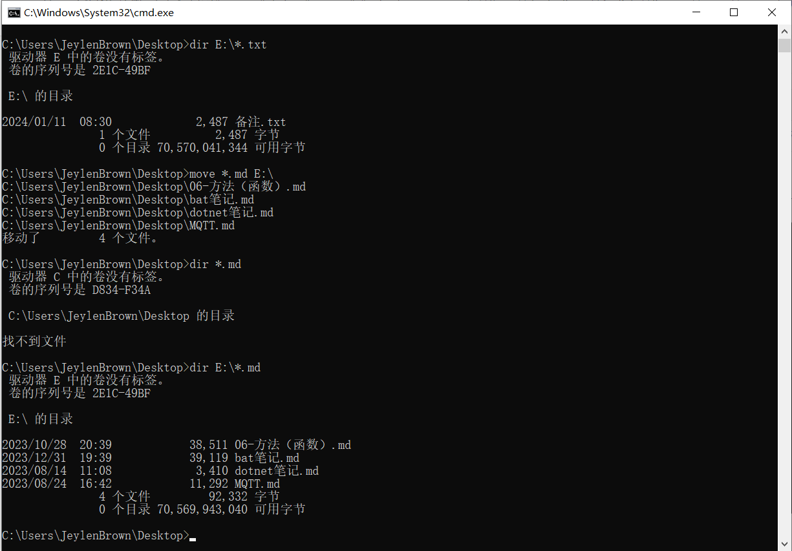

# 4.1. 显示目录

| 命令 |     语法      |                      作用                      |
| :--: | :-----------: | :--------------------------------------------: |
| dir  | `dir /?` 查询 | 显示目录中的文件和子目录列表，direction 的缩写 |

其常用参数入下表，其他参数通过 `shutdown /?` 查询：

|   参数   |                     作用                     |
| :------: | :------------------------------------------: |
| 没有参数 | 显示目录中的文件和子目录列表，不包括隐藏目录 |
|    /A    |        显示具有属性 Attribute 的文件         |

显示目录中的文件和子目录列表，不包括隐藏目录。

显示具有属性 Attribute 的文件，不加任何参数值则显示全部目录中的文件和子目录列表，包括隐藏目录。

只显示隐藏文件。

# 4.2. 新建、删除目录

|     命令      |            语法             |   作用   |
| :-----------: | :-------------------------: | :------: |
| mkdir 或者 md |      `md [drive:]path`      | 新建目录 |
| rmdir 或者 rd | `rd [/s] [/q] [drive:]path` | 删除目录 |

| 参数 | 含义  |                             作用                             |
| :--: | :---: | :----------------------------------------------------------: |
|  /s  |       | 除目录本身外，还将删除指定目录下的所有子目录和文件。用于删除目录树/非空目录 |
|  /q  | quiet |               安静模式，删除目录树时不要求确认               |

删除非空目录。

# 4.3. 目录切换

|     命令      |        语法         |                           作用                           |
| :-----------: | :-----------------: | :------------------------------------------------------: |
| chdir 或者 cd | `cd [drive:][path]` | 显示当前目录名或改变当前目录，不加任何参数则显示当前目录 |

> cd .  表示打开当前目录，跟 cd 效果相同
> cd .. 表示打开父级目录。

# 4.4. 文件/目录重命名

如果目录为空，可以先 rd 命名错误的目录，再 md 命名正确的目录。

如果目录不为空，只能通过 ren 实现重命名。

|      命令       |                 语法                 |    作用    |
| :-------------: | :----------------------------------: | :--------: |
| rename 或者 ren | `ren [drive:][path] oldName newName` | 重命名文件 |

# 4.5. 文件复制

| 命令 |      语法      |                      作用                      |
| :--: | :------------: | :--------------------------------------------: |
| copy | `copy /?` 查询 | 将目录下的文件（不是整个目录）复制到另一个位置 |

# 4.6. 文件删除

| 命令 |     语法      |        作用        |
| :--: | :-----------: | :----------------: |
| del  | `del /?` 查询 | 删除一个或多个文件 |

其参数入下表：

| 参数  | 作用                                                         |
| :---: | ------------------------------------------------------------ |
| names | 指定一个或多个文件或者目录列表。通配符可用来删除多个文件。如果指定了一个目录，该目录中的所有文件都会被删除 |
|  /p   | 删除每一个文件之前提示确认                                   |
|  /f   | 强制删除只读文件                                             |
|  /s   | 删除所有子目录中的指定的文件                                 |
|  /q   | 指定要终止的进程的映像名称。通配符 '*'可用来指定所有任务或映像名称 |
|  /a   | 根据属性选择要删除的文件                                     |

# 4.7. 文件剪切

如果仅仅是移动单个文件时，新的路径要已存在。如果不存在，则要携带扩展名，不携带扩展名会导致文件重命名，扩展名丢失。

|                           命令                            |                作用                |
| :-------------------------------------------------------: | :--------------------------------: |
| `MOVE [/Y /-Y] [drive:][path]filename1[,...] destination` |         要移动至少一个文件         |
|     `MOVE [/Y |/-Y] [drive:][path]dirName1 dirName2`      | 重命名一个目录，但不能跨磁盘重命名 |

移动多个文件。

不能跨父目录重命名，否则提示拒绝访问。

# 4.8. 文件/目录遍历

|        命令        |     作用      |
| :----------------: | :-----------: |
| `forfiles /?` 查询 | 文件/目录遍历 |

文件/目录遍历。

找到目录下所有 .html 文件。

指导 forfiles 递归到子目录。像 `dir /s`。

`/c` 开关是文件/目录遍历完成后，对所遍历的内容执行其他内部命令（内部 cmd.exe 命令前面应以 `"cmd /c"` 开始），如果不加任何参数值，默认命令是 `"cmd /c echo @file"`。

|   命令   |                         作用                          |
| :------: | :---------------------------------------------------: |
|  @file   |                      返回文件名                       |
|  @path   |                  返回文件的完整路径                   |
| @relpath |                  返回文件的相对路径                   |
|  @isdir  | 如果文件类型是目录，返回 TRUE；如果是文件，返回 FALSE |
|  @fsize  |               以字节为单位返回文件大小                |
|  @fdate  |               返回文件上一次修改的日期                |
|  @ftime  |               返回文件上一次修改的时间                |

用记事本文件打开目录下所有 html 文件。

