# 5.1. 用户操作

|   命令   |         语法          |              作用               |
| :------: | :-------------------: | :-----------------------------: |
| net user | `net user /help` 查询 | 对 Windows 用户帐户进行相关操作 |

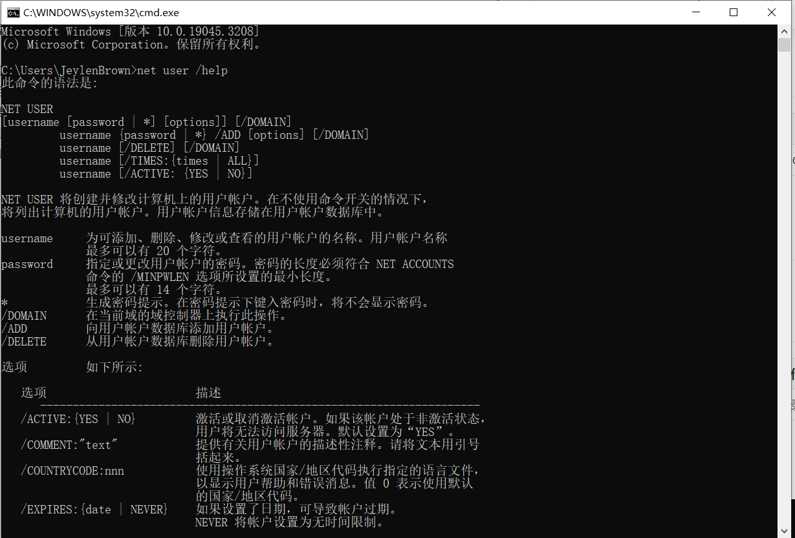

查询当前所有用户账户。

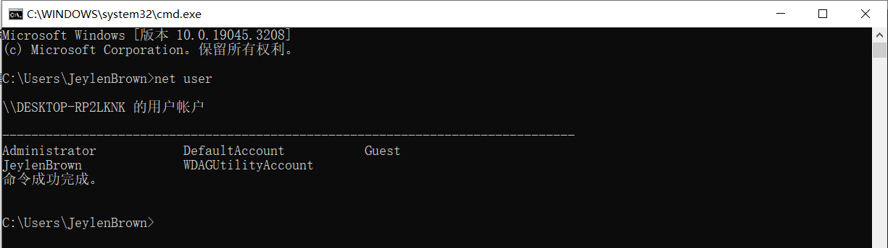

==使用管理员权限打开 cmd ，因为使用 net user 命令操作（创建或者删除）用户账户需要最高权限==，如果不使用管理员权限打开 cmd ，执行命令后会提示`发生系统错误 5。 拒绝访问`。

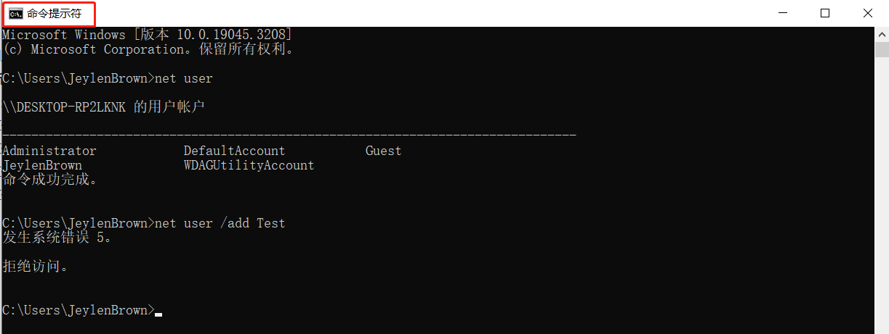

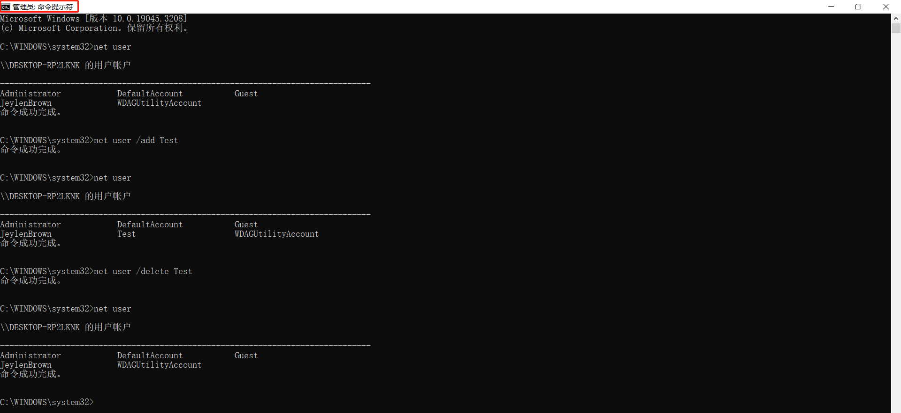

查询某个用户详细信息。

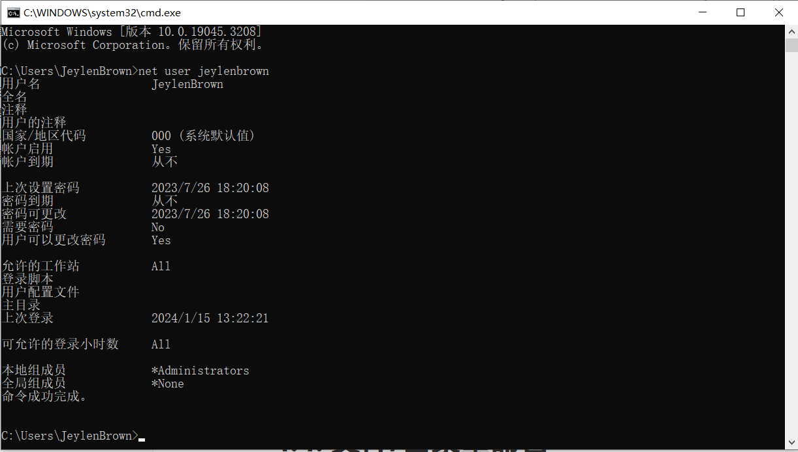

用 shutdown 整蛊他人电脑，举例如下：

|                          命令                          |           作用            |
| :----------------------------------------------------: | :-----------------------: |
| net use \\172.26.73.50\ipc$"" /user:"domain\huangfan"  |  建立 ipc 连接，输入密码  |
|         shutdown -r -t 1000 -m \\172.26.73.50          | 远程重启-提示什么时候重启 |
| shutdown -r -t 1000 -m \\172.26.73.50 -c "立即重启" -f | 远程重启-仅仅提示立即重启 |
|    shutdown -r -t 1000 -m \\172.26.73.50 -c " " -f     | 远程重启-不提示且强制重启 |

# 5.2. 用户组操作

用 `net user /add Test` 创建的用户，并使用 `net use Test` 查看该用户时，发现该用户属于 Users 用户组，Users 用户组在 Windows 中不具有更高的权限。可以使用 `net localgroup` 命令来提升权限。

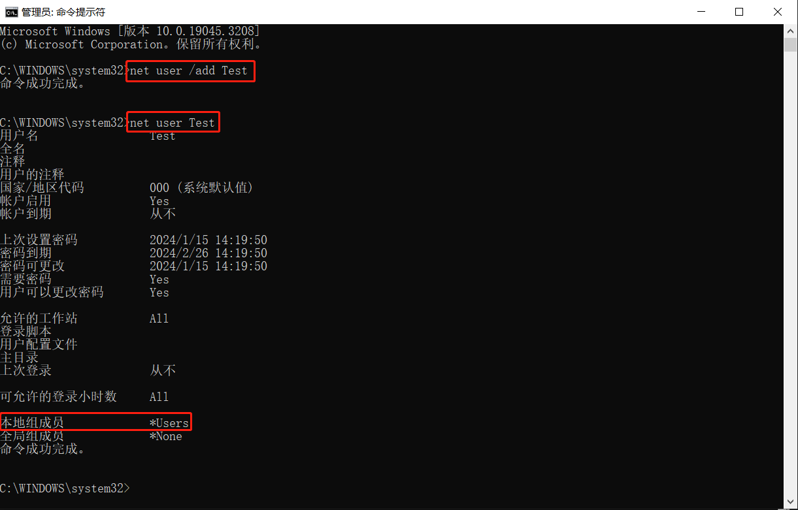

|      命令      |            语法             |                             作用                             |
| :------------: | :-------------------------: | :----------------------------------------------------------: |
| net localgroup | `net localgroup /help` 查询 | 修改计算机上的本地组。使用时如果没有选项，它将显示计算机上的本地组 |

显示计算机上的本地组。

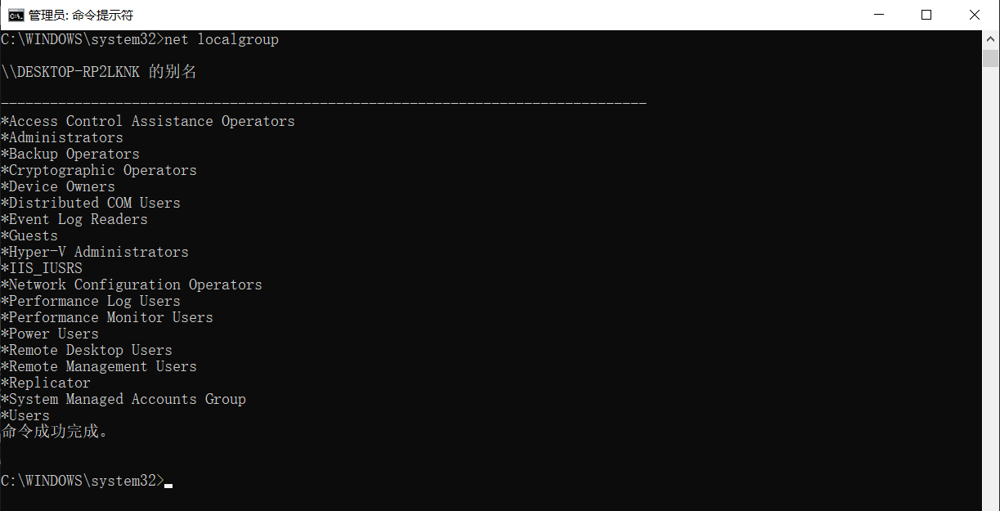

在 Administrators 最高权限用户组添加 Test 用户。

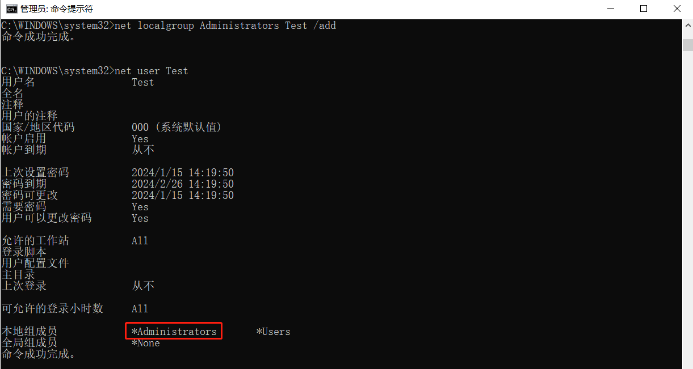

在 Administrators 最高权限用户组删除 Test 用户。

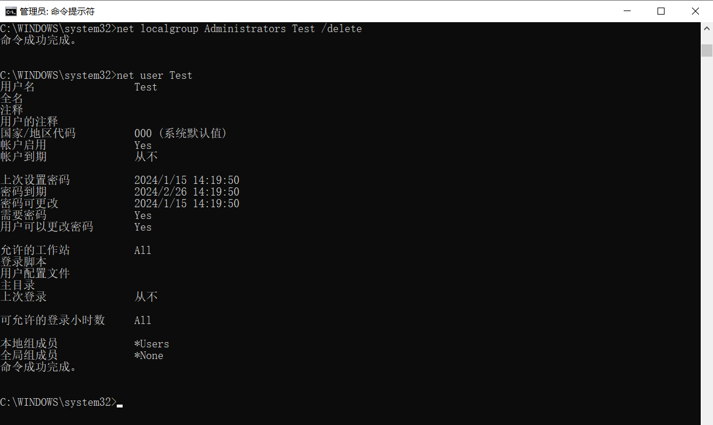

# 5.3. 网络联通检测

## 5.3.1. 定义

使用 ping 可以测试计算机名和计算机的 IP 地址，验证与远程计算机的网络连接是否通畅。该命令只有在安装 TCP/IP 协议后才可以使用（主流操作系统默认已安装）。其中防火墙等网络数据包过滤工具可能会导致 ping 命令测试失败，导致 ping 结果出现 Request timed out 异常提示。 

## 5.3.2. 命令使用

| 命令 |      语法      |     作用     |
| :--: | :------------: | :----------: |
| ping | `ping /?` 查询 | 网络联通检测 |

## 5.3.3. 原理

源主机（输入 ping 命令的主机）向目标主机发送一个 ICMP 协议中的 echo 包；如目标主机存活，就向源主机返回一个 ICMP 协议的echo-reply 包。

以下面一个网络为例：有 A、B、C、D 四台主机（其中 A、B 的 IP 分别为 192.168.0.4-192.168.0.5 ，子网掩码均为 255.255.255.0 ；C、D 的 IP 分别为 192.168.1.3-192.168.1.4 ，子网掩码均为 255.255.255.0 ），一台路由 RA 连接以上两个子网。 

①在同一网段内，在主机 A 上运行 `Ping 192.168.0.5` ：
首先，ping 命令会构建一个固定格式的 ICMP 请求数据包，然后由 ICMP 协议将这个数据包连同地址 192.168.0.5 一起交给 IP 层协议（和 ICMP一样，实际上是一组后台运行的进程），IP 层协议将以地址 192.168.0.5 作为目的地址，本机 IP 地址作为源地址，加上一些其他的控制信息，构建一个 IP 数据包，并想办法得到 192.168.0.5 的 MAC 地址（物理地址，这是数据链路层协议构建数据链路层的传输单元——帧所必需的），以便交给数据链路层构建一个数据帧。然后，==IP 层协议通过对比机器 B 的 IP 地址、自己的 IP 地址和自己的子网掩码，发现它跟自己属同一网络，就直接在本网络内查找这台机器的 MAC。==（如果以前两机有过通信，在 A 机的 ARP 缓存表应该有 B 机 IP 与其 MAC 的映射关系；如果没有，就发一个 ARP 请求广播，得到 B 机的 MAC， 一并交给数据链路层）后者构建一个数据帧，目的地址是 IP 层传过来的物理地址，源地址则是本机的物理地址，还要附加上一些控制信息，依据以太网的介质访问规则，将它们传送出去。 主机 B 收到这个数据帧后，先检查它的目的地址，并和本机的物理地址对比，如符合，则接收；否则丢弃。接收后检查该数据帧，将 IP 数据包从帧中提取出来，交给本机的 IP 层协议。同样，IP 层检查后，将有用的信息提取后交给 ICMP 协议，后者处理后，马上构建一个ICMP 应答包，发送给主机 A，其过程和主机 A 发送 ICMP 请求包到主机 B 一模一样。 

②不在同一网段内，在主机 A 上运行 `Ping 192.168.1.4` ：
开始跟上面一样，到了怎样得到 MAC 地址时，IP 协议通过计算发现 D 机与自己不在同一网段内，就直接交给路由处理，也就是将路由的 MAC 取过来，至于怎样得到路由的 MAC，跟上面一样，先在 ARP 缓存表找，找不到就在广播找。路由得到这个数据帧后，再跟主机 D 进行联系，如果找不到，就向主机 A 返回一个超时的信息。 

##  5.3.4. 结果分析

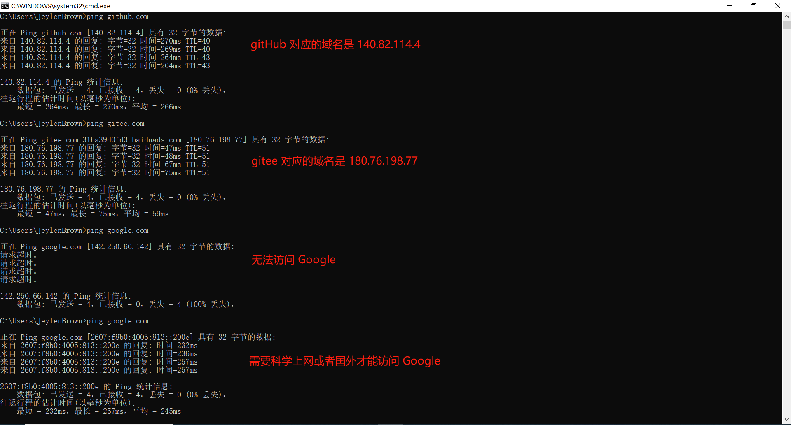

上图为 ping 返回的结果：

①ping 命令用 32 字节（这是 Windows 默认发送的数据包大小，如要改变，则应该在后面加上 `-l 数据包大小` ，如 `Ping 47.103.24.173 -l 500` 表示要测试的数据包大小为 500 字节）的数据包来测试能否连接到 IP 地址为 47.103.24.173 的主机；

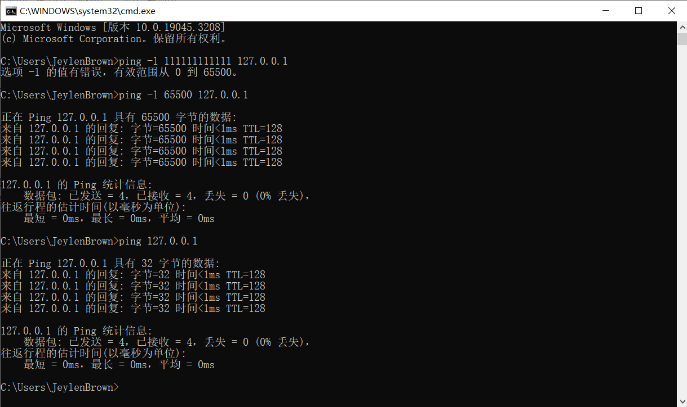

②四行 `来自 47.103.24.173 的回复`  表示本地主机已收到从被测试的机器上返回的信息--返回 32 个字节分别用了 43、44、43、41 毫秒，TTL （Time to Live，存在时间值，通过该值可以算出数据包经过多少个路由器，方法是用 255 减去返回的 TTL 值.，例如本例中返回 87，则应该用 255 来减去 87，得到 168。）的意思是为 168。

③数据包：表示发送了 4 个数据包，4 是系统的缺省值（默认值）。如要指定发送数据包的次数，则在后面加上 `-n 次数`，如 `ping 47.103.24.173 –n 20` 表示发送 20 次；如果希望一直 ping 下去，则要在后面加上参数 `-t` ，此时要中断则需要按 Ctrl+C 。收到了 4 个，共丢失了 0 个，发送时间最小为 41 毫秒，最大 44 毫秒，平均时间为 42 毫秒。

## 5.3.5. ping 失败的结果分析

①Request timed out

- 对方已关机，或者网络上根本没有这个地址都会得到超时的信息。  
- 对方与自己不在同一网段内，通过路由也无法找到对方，但对方确实是存在的。
- 对方确实存在，但设置了 ICMP 数据包过滤（比如防火墙设置）：怎样知道对方是存在，还是不存在呢，可以用带参数 -a 的 ping 命令探测对方，如果能得到对方的 netbios 名称，则说明对方是存在的，是有防火墙设置，如果得不到，多半是对方不存在或关机，或不在同一网段内。
- 错误设置 IP 地址：正常情况下，一台主机应该有一个网卡一个 IP 地址，或多个网卡多个 IP 地址（这些地址一定要处于不同的 IP 子网）。但如果一台电脑的拨号网络适配器（相当于一块软网卡）的 TCP/IP 设置中，设置了一个与网卡 IP 地址处于同一子网的 IP 地址，这样，在 IP 层协议看来，这台主机就有两个不同的接口处于同一网段内。当从这台主机 ping 其他的机器时，会存在这样的问题：(1) 主机不知道将数据包发到哪个网络接口，因为有两个网络接口都连接在同一网段。(2) 主机不知道用哪个地址作为数据包的源地址。因此，从这台主机去 ping 其他机器，IP 层协议会无法处理，超时后，ping 就会给出一个`超时无应答`的错误信息提示。但从其他主机 ping 这台主机时，请求包从特定的网卡来，ICMP 只须简单地将目的、源地址互换，并更改一些标志即可，ICMP 应答包能顺利发出，其他主机也就能成功Ping通这台机器了。

②Destination host Unreachable：对方与自己不在同一网段内，而自己又未设置默认的路由，比如上例中 A 机中不设定默认的路由网线出了故障

> 这里要说明一下 destination host unreachable 和 time out 的区别。如果所经过的路由器的路由表中具有到达目标的路由，而目标因为原因不可到达，这时候会出现 time out ；如果路由表中连到达目标的路由都没有，那就会出现 destination host unreachable。

③Bad IP address：这个信息表示您可能没有连接到 DNS 服务器，所以无法解析这个 IP 地址，也可能是 IP 地址不存在。

④Source quench received：这个信息比较特殊，它出现的机率很少。它表示对方或中途的服务器繁忙无法回应。

⑤Unknown host：不知名主机，意思是该远程主机的名字不能被域名服务器转换成 IP 地址。故障原因可能是域名服务器有故障，或者其名字不正确，或者网络管理员的系统与远程主机之间的通信线路有故障。

⑥No answer：无响应，这种故障说明本地系统有一条通向中心主机的路由，但却接收不到它发给该中心主机的任何信息。故障原因可能是下列之一，中心主机没有工作、本地或中心主机网络配置不正确、本地或中心的路由器没有工作、通信线路有故障、中心主机存在路由选择问题。

==⑦127.0.0.1是本地回环地址，如果无法 ping 通，则表明本地机 TCP/IP 协议（网卡）不能正常工作。==

⑧no route to host：网卡工作不正常。

⑨transmit failed，error code：10043 网卡驱动不正常。

⑩unknown host name：DNS 配置不正确。

# 5.4. 网络连接

|  命令  |       语法       |       作用        |
| :----: | :--------------: | :---------------: |
| telnet | `telnet /?` 查看 | 端口/主机连接测试 |

直接在命令行输入命令，会提示 telnet 不是内部或者外部命令，也不是可运行程序。

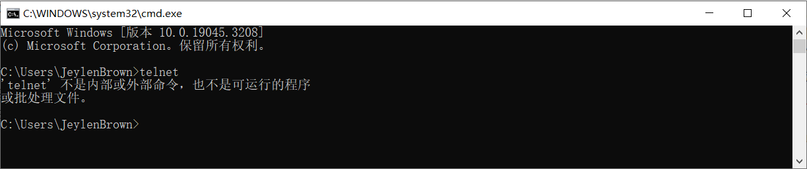

解决办法：控制面板→程序(小图标下直接到【程序和功能】) →程序和功能 →打开或关闭 Window 功能→选择 telnet 客户端

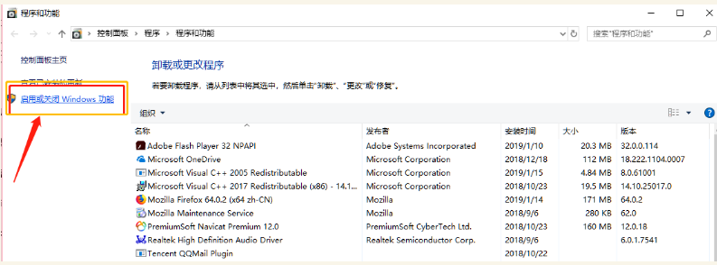

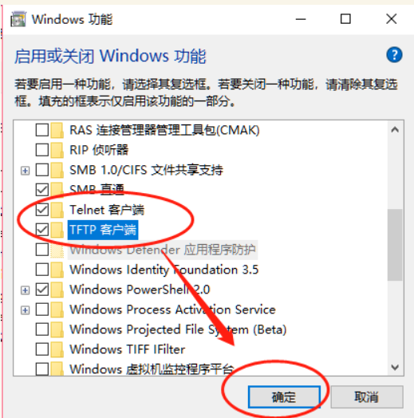

# 5.5. 路由查看

|  命令   |       语法        |                             作用                             |
| :-----: | :---------------: | :----------------------------------------------------------: |
| tracert | `tracert /?` 查询 | 检查本地主机与远程主机经过多少个网络设备（IP 地址）才能正常连接 |

本地主机到 github.com 经过 23 个跃点才连接上。

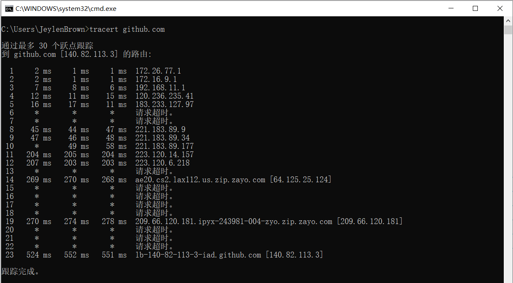

# 5.6. 网络适配器

|         命令         |                             作用                             |
| :------------------: | :----------------------------------------------------------: |
|      `ipconfig`      |                     查询 Windows IP 配置                     |
|   `ipconfig /all`    |                   查询 Windows IP 配置详情                   |
| `ipconfig /flushdns` | 清除计算机上存储的所有 DNS 缓存，可能解决访问网站出现的问题，例如无法访问特定网站或访问缓慢 |

# 5.7. arp 信息

| 命令 |     语法      |                             作用                             |
| :--: | :-----------: | :----------------------------------------------------------: |
| arp  | `arp /?` 查询 | 显示和修改地址解析协议 arp 使用的 IP 地址到物理地址 MAC 的转换表 |

通过询问当前协议数据，显示当前 ARP 项。即显示每一个网络适配器对应的 arp 表，注意无论网段是否相同，每一张网卡具有不同的 IP 地址。

- 动态的 IP 是临时分配的，动态类型的 IP 地址释放后，重新连接网络会分配新的 IP 地址。
- 静态的 IP 是固定不变的，静态类型的 IP 地址释放后，重新连接网络会分配原来 IP 地址。

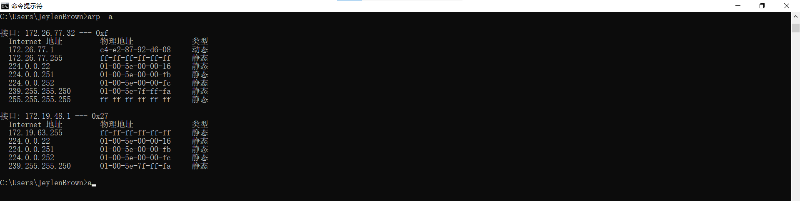

添加主机并且将 Internet 地址 inet_addr 与物理地址 eth_addr 相关联。物理地址是用连字符分隔的 6 个十六进制字节。该项是永久的。设置时需要管理员权限。

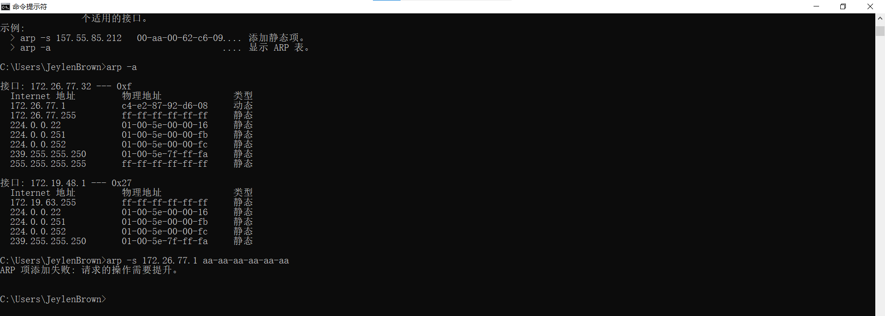
