# 6.1. 条件判断 if else

```bash
@echo off
rem 写一个 if else 结构的条件判断
rem 批处理编程不像其他编程加空格为了方便阅读
set password=123
rem 在批处理脚本中，一行就是一个命令，所以 if-else 不能换行写，否则会报语法错误-else不是内部或外部命令
if %password%==123	(echo 登陆成功)	else	(echo 登陆失败)
rem 将《请按任意键继续》重定向，输出到空设备，不显示《请按任意键继续》
pause>nul
```


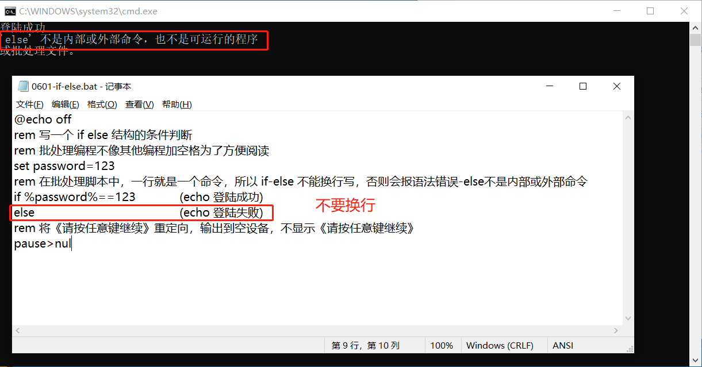

# 6.2. 文件存在 exist

```bash
@echo off
dir E:\CSharp\Markdown\bat\06-流程控制
if exist E:\CSharp\Markdown\bat\06-流程控制\06-流程控制.md	(echo 文件存在)	else	(echo 文件不存在)
pause>nul
```

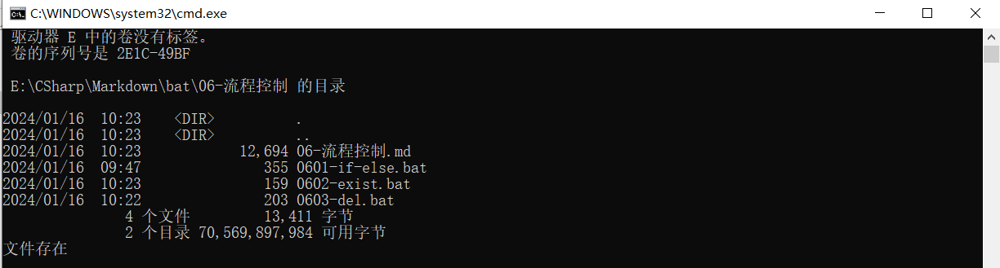

```bash
@echo off
dir E:\CSharp\Markdown\bat\06-流程控制
if exist E:\CSharp\Markdown\bat\06-流程控制\rm.txt (
	echo 文件存在，执行删除 del 命令
	del rm.txt
) else (
	echo 文件不存在，程序结束
)
pause>nul
```

第一次执行，找到文件并删除。

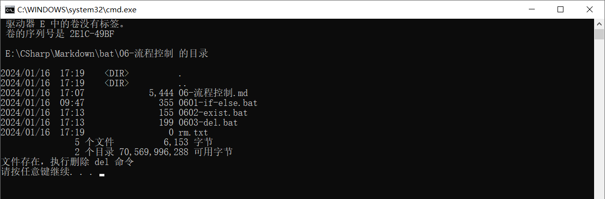

第二次执行，找不到文件，程序结束。

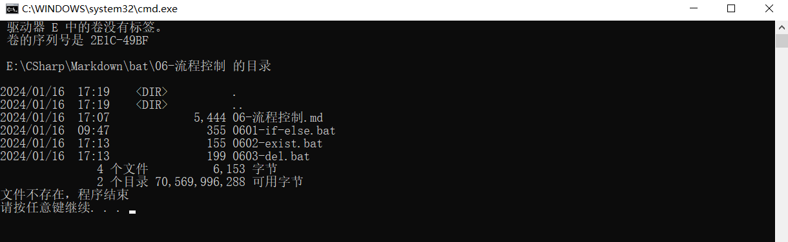

# 6.3. 循环结构

|                        命令                        |                  作用                  |
| :------------------------------------------------: | :------------------------------------: |
|    `for /d %变量 in (目录路径\\*) do 具体操作`     | 遍历目录（不是遍历文件）并执行相关操作 |
| `for /r 目录路径\\* %变量 in 匹配规则 do 具体操作` |     遍历目录下的文件并执行相关操作     |
|  `for /l %变量 (初始值,步长,最终值) do 具体操作`   |         遍历数字并执行相关操作         |
|         `for /f %变量 (文件) do 具体操作`          |              遍历文件内容              |

```bash
@echo off
dir E:\CSharp\Markdown\bat
rem /d表示遍历目录，不是遍历文件
rem 将遍历的目录名存储到变量 a 中，并输出目录名
for /d %%a in (E:\CSharp\Markdown\bat\*) do echo %%a
pause>nul
```

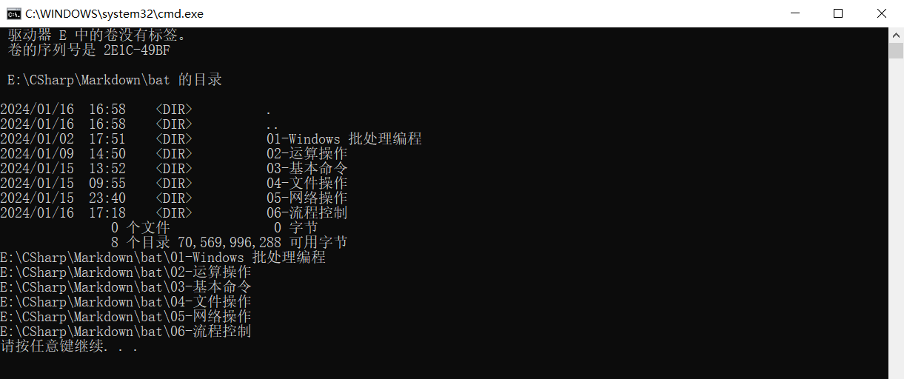

貌似不能跨目录删除其他磁盘目录。

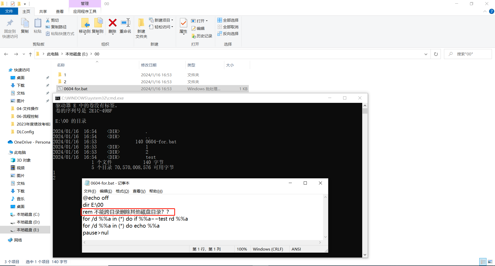

遍历目录下的文件并执行删除操作。

```bash
@echo off
rem 遍历目录下符合扩展名为bat的文件，并输出文件
for /r E:\CSharp\Markdown\bat\06-流程控制\1\ %%a in (*.bat) do echo %%a
rem 遍历目录下符合扩展名为bat的文件，并删除文件
for /r E:\CSharp\Markdown\bat\06-流程控制\1\ %%a in (*.bat) do del %%a
dir E:\CSharp\Markdown\bat\06-流程控制\1
pause
```

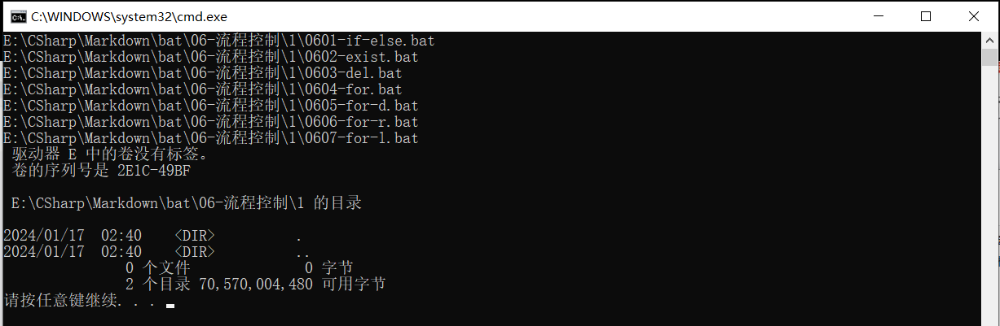

```bash
@echo off
for /l %%a in (1,2,5) do echo %%a
rem 在初始值为1、步长为2、最终值为7中循环遍历出符合条件的数字，存放到变量a中
rem 新开一个cmd，传递一个参数，执行ping命令操作
for /l %%a in (1,2,5) do ping %1.%%a
pause
```

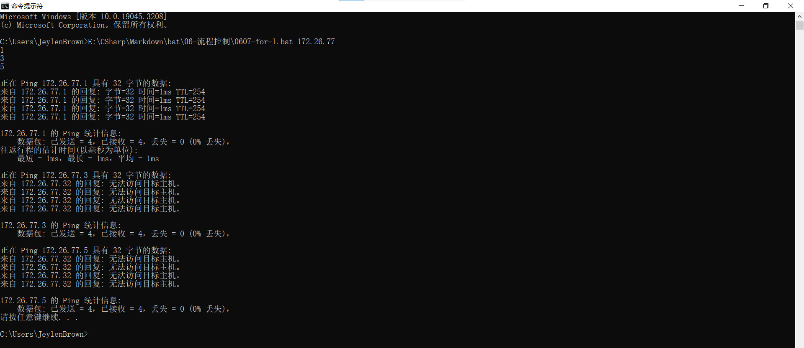

遍历文件的内容，只输出每一行的首个单词。

```bash
@echo off
type E:\CSharp\Markdown\bat\06-流程控制\0608-for-f.bat
rem 对文件内容遍历，存放到变量a中，执行echo命令操作
for /f %%a in (E:\CSharp\Markdown\bat\06-流程控制\0608-for-f.bat) do echo %%a
pause
rem 下面空两行


```

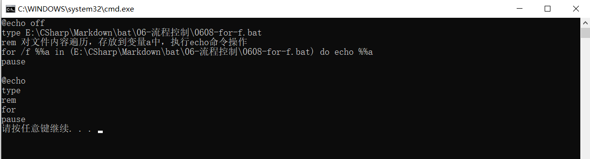

遍历 path 环境变量。

```bash
::@符号表示禁止命令自身的回显
@echo 遍历path环境变量

::@echo off 表示关闭命令的回显，命令不会在屏幕上显示出来
@echo off
::将系统的path环境变量的值赋给变量str
set str=%path%

:loop
::tokens=1* 参数	表示将文本分解为两个部分，第一个部分赋值给变量%%a，第二个部分赋值给变量%%b
::delims=;	   参数	指定分隔符为分号
for /f "tokens=1* delims=;" %%a in ("%str%") do (
    ::输出第一个分段的内容，即输出每个路径
    echo %%a
    rem 将剩下的部分赋值给变量str，以便下一次循环使用。如果没有剩余分段，则str变量将被清空
    set str=%%b
)
::如果还有剩余，则继续分割
if defined str goto loop
pause
```

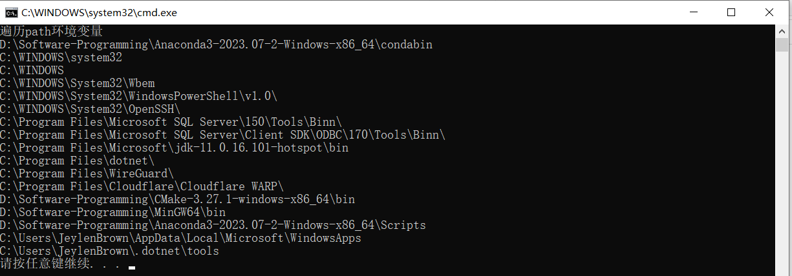

# 6.4. 跳转

| 命令 |             语法             |       作用       |
| :--: | :--------------------------: | :--------------: |
| goto | :loop<br/>命令<br/>goto loop | 跳转到标志位执行 |

```
@echo off
::del	仅仅是删除文件夹下的文件
::/f	强制删除只读文件
::/s	从所有子目录删除指定文件
::/q	安静模式，删除时不要求确认
::	-n 18000 表示 ping 几次，ping 一次大概一秒钟，如果不加这个参数去使用 ping 命令，默认会 ping 四次。

echo 当前盘符			：%~d0
echo 当前盘符和路径			：%~dp0
echo 当前脚本全路径			：%~f0
echo 当前CMD默认目录			：%cd%
echo 删除%~dp0目录下所有的bmp文件

:loop
del %~dp0*.bmp /f /s /q
ping 127.0.0.1 -n 18000
goto loop
```

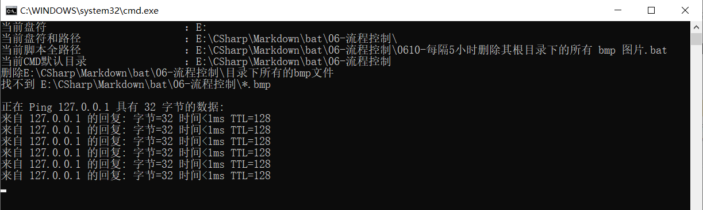

