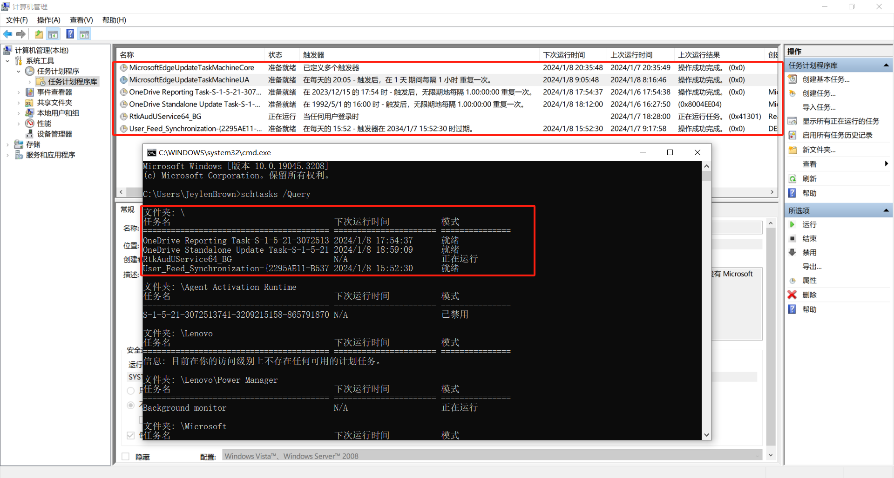

# 7.1. 打印计算机相关信息

使用批处理脚本保存计算机具体内容到指定文件 0701-ComputerInfo.log 。

```bash
@echo off
rem 使用批处理脚本保存计算机具体内容到指定文件 0701-ComputerInfo.log
rem 在开发过程中，会碰到庞大的脚本代码。当脚本出现 Bug 需要进行排查时，会使开发者焦头烂额，而日志能很好的记录脚本运行过程中所产生的信息，并能定位异常
rem 开发中常用来写日志的包：①Python 自带日志包 logging ；②R语言的 log4r 包

echo 将当前文件全路径写入日志 >> 0701-ComputerInfo.log
echo %cd%\0701-ComputerInfo.log >> 0701-ComputerInfo.log
echo 在 %username% 运行脚本 %~f0 >> 0701-ComputerInfo.log

rem echo.表示换行
echo. >> 0701-ComputerInfo.log
rem 打印当前用户名，%username%是系统变量
echo User : %username% >> 0701-ComputerInfo.log
rem 打印当前时间
date /t >>0701-ComputerInfo.log
time /t >> 0701-ComputerInfo.log

echo. >> 0701-ComputerInfo.log
ipconfig /all >> 0701-ComputerInfo.log

echo. >> 0701-ComputerInfo.log
echo 打印本地或远程机器上显示当前运行的进程列表 >> 0701-ComputerInfo.log
tasklist >> 0701-ComputerInfo.log

rem 退出程序
exit
```

运行批处理脚本后生成 0701-ComputerInfo.log 文件。


为了更方便、远程访问日志，编写一个 html 网页，本地开启 HTTP 服务，将指定文件放在根目录下，通过浏览器访问。

```html
<html>
	<head><title>打印计算机相关信息 - Lo36r</title></head>
	<body>
		<br>
			<center>
				<h1><u>ComputerInfo.log</u></h1>
				<i>注意：这个日志文件由 <b>Lo36r</b> 创建，用于监视系统活动</i>
			</center>
		<br>
			<center>
				<ui>
					<a href="0701-ComputerInfo.log">Click here to view the Log File</a>
				</ui>
			</center>
	</body>
</html>
```


网页显示日志文件。


如果更新批处理文件，重新运行批处理文件，刷新网页即可。

# 7.2. 交互操作

用户输入具体的选项，程序根据输入进行判断，执行相应的程序，用户就不需要每次输入命令的方式来执行批处理文件。

```bash
@echo off
:main
pause
cls
echo 1.展示 Windows IP 配置
echo 2.展示 当前目录
echo 3.展示 当前用户帐户
echo 4.打开 计算器
echo 5.锁屏
echo 6.睡眠
echo 0.退出 程序

echo 请输入您的选择
rem 从标准输入当中获取用户输入的值，保存到变量 option 中
set /p option=
if %option%==1	goto one
if %option%==2	goto two
if %option%==3	goto three
if %option%==4	goto four
if %option%==5	goto five
if %option%==6	goto six
if %option%==0	goto zero
echo 输入不合法选项，返回主菜单重新输入，直到输入正确的选项
goto main

:one
ipconfig
goto main

:two
dir
goto main

:three
net user %Username%
goto main

:four
calc
goto main

:five
rundll32.exe user32.dll LockWorkStation
goto main

:six
shutdown -h
goto main

:zero
exit
```

运行批处理文件，cmd 如图所示，请按任意键继续。


主菜单如图，输入需要的选项（这里以 1 为演示）。


执行相应的命令，完成后，请按任意键继续。


返回原来的主菜单，如果输入非法的值，则提示输入不合法选项，返回主菜单重新输入，直到输入正确的选项。如果输入 0 ，则退出程序


# 7.3. 计划任务

在计算机中可以设定固定的计划在固定时间完成相应的任务。

## 7.3.1. 可视化创建任务计划程序

新建记事本编写脚本内容，内容如下。

```bash
::del_path	表示删除文件所在文件夹
::/p		表示查询指定文件夹
::/d		表示日期。 -7 是指离当前时间七天，如果需要十天就是 -10
::/m		*.xxx 为删除的文件类型
::/q		不提示删除确认
::/s		表示删除本身目录及其所有的子目录与文件
::del		删除文件
::rd		删除文件夹 

::删除指定路径下 7 天以前的文件夹
set "del_path=E:\SrcImage\"
forfiles /p %del_path%  /d -7 /s /c "cmd /c del /q /s @path\"
```

将记事本另保存为 ANSI 格式，否则运行脚本中文会乱码，并将文件扩展名更改为 bat 或者 cmd 


点击此电脑→管理。


点击计算机管理（本地）→系统工具→任务计划程序库→创建任务，进入创建任务界面。


常规：填写名称和选择用户。


触发器：填写任务计划。


操作：选择启动程序，然后选择程序或脚本所在路径。


条件：仅需注意电源操作。


设置：仅勾选两个选项即可：


完成后任务计划如图。


> 注意：创建基本任务和创建任务的操作基本相同，效果基本相同，区别是创建基本任务缺少条件设置，即没有电源选项操作。

## 7.3.2. 使用 schtasks 命令。

|   命令   |            语法             |                             作用                             |
| :------: | :-------------------------: | :----------------------------------------------------------: |
| schtasks | `schtasks /参数列表 参数值` | 允许管理员创建、删除、查询、更改、运行和中止本地或远程系统上的计划任务 |

其参数入下表：

|   参数   |                 作用                 |
| :------: | :----------------------------------: |
| /Create  |            创建新计划任务            |
| /Delete  |             删除计划任务             |
| /Change  |           更改计划任务属性           |
|  /Query  |           显示所有计划任务           |
|   /Run   |           按需运行计划任务           |
|   /End   |      中止当前正在运行的计划任务      |
| /ShowSid | 显示与计划的任务名称相应的安全标识符 |



创建计划任务名字 TaskName 为 "同时启动两个微信" ，计划任务频率 Schedule 为每周一，计划任务启动时间 StartTime 为 09:50:00 ，计划任务运行文件路径 TaskRun 为 D:\Software-Tool\WeChat\微信双开.bat ：`schtasks -create -tn "同时启动两个微信" -sc weekly -d Mon /st 09:50:00 /tr D:\Software-Tool\WeChat\微信双开.bat`

> 注意：①其他参数使用详情见命令 schtasks -create -? ；
> ②-st 参数的时间格式是 hh:mm:ss ，如上午九点书写为 09:00:00 ，不是 9:00:00 ；
> ③如果不执行命令，首先检查当前用户是都有权限执行命令，再检查电源选项是否取消勾选，用命令创建的基本任务默认是勾选`只有在计算机使用交流电时才启动任务`。

# 7.4. bat 转 exe 程序

使用 Bat_To_Exe_Converter 实现批处理脚本转化为 exe 程序。


